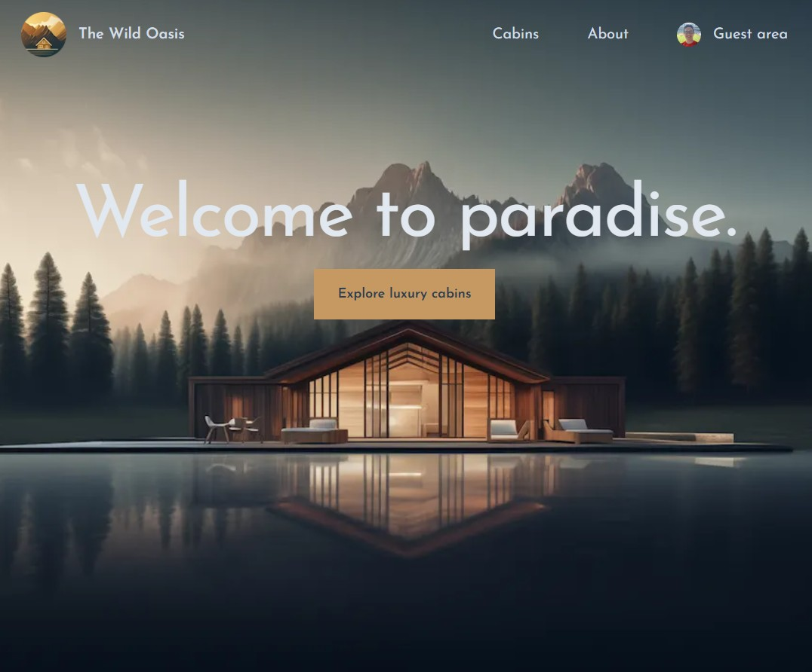

# 🌲 The Wild Oasis

**The Wild Oasis** is a sleek and modern cabin booking web app where users can log in with their Google account, browse cabins, make reservations, edit or delete them, and manage personal data — all from an elegant and intuitive interface.

📺 [Live App on Vercel](https://nextjs-the-wild-oasis-beta.vercel.app/)

---

## ✨ Features

- 🔐 **Google Sign-In** using NextAuth
- 📅 **Book Cabins** with total cost and guest tracking
- 🧾 **Manage Reservations**: Edit or cancel existing bookings
- 🧍 **User Dashboard**: View past and upcoming reservations
- 👤 **Profile Page**: Update personal details
- 💅 **Responsive Design** with Tailwind CSS

---

## 🧰 Tech Stack

- **Framework**: [Next.js](https://nextjs.org/)
- **Styling**: [Tailwind CSS](https://tailwindcss.com/)
- **Authentication**: [NextAuth.js](https://next-auth.js.org/) with Google Provider
- **Database/API**: Supabase (for data storage and queries)
- **Image Hosting**: Supabase Storage
